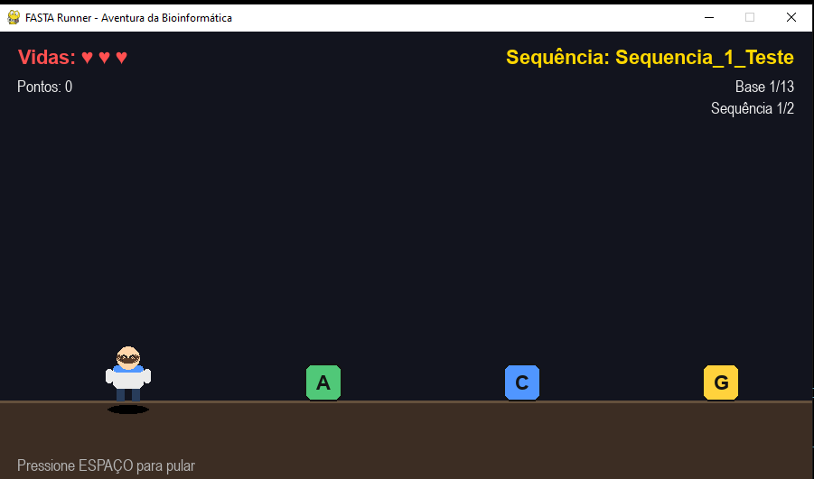

<div align="center">

# 🧬 FASTA Runner

### O jogo de plataforma que ensina bioinformática pulando!

*Carregue seu próprio arquivo FASTA e pule sobre cada base nitrogenada até chegar ao fim da sequência.*


</div>

---

## 🎮 Sobre o jogo

**FASTA Runner** transforma uma sequência de DNA em uma pista de obstáculos.
Cada base nitrogenada (**A**, **C**, **G**, **T**) vira um bloco que se
aproxima do seu personagem, e você precisa apertar **ESPAÇO** na hora certa
para pular por cima dela — como um Chrome Dino, só que com biologia
molecular de verdade.

| Base | Cor no jogo |
|------|-------------|
| 🟢 A (Adenina)  | Verde |
| 🔵 C (Citosina) | Azul |
| 🟡 G (Guanina)  | Amarelo |
| 🔴 T (Timina)   | Vermelho |

Se o seu arquivo `.fasta` tiver várias sequências, o jogo cria uma **fase
para cada uma delas**. Complete todas para ver a mensagem final:

> **"Parabéns, Padawan da Bioinformática. Você chegou até o fim!"**



---

## 🕹️ Como jogar

### 1. Instale as dependências

```bash
pip install pygame
```

### 2. Rode o jogo

Você pode simplesmente executar o script e informar o caminho do arquivo
quando o jogo pedir:

```bash
python fasta_runner.py
```

Ou já passar o arquivo direto pela linha de comando:

```bash
python fasta_runner.py exemplo.fasta
```

### 3. Use o arquivo de exemplo incluso

O repositório já vem com um `exemplo.fasta` prontinho para teste:

```text
>Sequencia_1_Teste
ACGTACGGTTACG
>Sequencia_2_Mitocondria
GGCATTACAGGT
```

Rodando `python fasta_runner.py exemplo.fasta`, o jogo vai carregar essas
duas sequências como duas fases seguidas. Na tela, o nome da sequência
atual (ex: `Sequência: Sequencia_1_Teste`) fica sempre visível no **canto
superior direito**, então você sabe em qual "cromossomo" está pulando.

### 4. Comandos

| Tecla | Ação |
|-------|------|
| `ESPAÇO` | Pular |
| `R` | Reiniciar (após vencer ou perder) |
| `ESC` | Sair do jogo |

### 5. Regras

- Você começa com **3 vidas** ❤️❤️❤️
- Cada colisão com uma base custa **1 vida**
- Cada base pulada com sucesso vale **10 pontos**
- Complete todas as bases da sequência para avançar de fase
- Zerou as vidas? Aperte `R` e tente de novo — a bioinformática exige
  persistência!

---

## 📁 Use seu próprio arquivo FASTA

Quer jogar com uma sequência real? Basta apontar o jogo para o seu
arquivo:

```bash
python fasta_runner.py meu_gene_favorito.fasta
```

⚠️ **Importante (v1):** por enquanto o jogo aceita apenas as bases
`A`, `C`, `G`, `T` (maiúsculas ou minúsculas). Se o arquivo tiver `N`,
`U` (RNA) ou qualquer outro caractere fora do padrão, o jogo vai te
avisar exatamente qual é o problema em vez de travar.

---

## 🚀 Roadmap / ideias futuras

- [ ] Suporte a RNA (base **U**) e bases ambíguas (N, R, Y, etc.)
- [ ] Sprites desenhados à mão no lugar das formas geométricas
- [ ] Efeitos sonoros e trilha sonora
- [ ] Modo "combo" com bônus de pontuação
- [ ] Ranking local salvo em arquivo
- [ ] Modo multiplayer: duas sequências, duas pistas, quem termina primeiro

Contribuições são bem-vindas! Abra uma *issue* ou mande um *pull request*.

---

## 🛠️ Stack técnica

- **Python 3.8+**
- **Pygame 2.6** — motor gráfico e de eventos
- Personagem e obstáculos desenhados **100% via código** (nenhum asset
  de imagem externo é necessário)

---

## 📜 Licença

Distribuído sob a licença MIT. Sinta-se livre para estudar, modificar e
compartilhar.

---

<div align="center">
🏆 Desafio do mês

Quem consegue pontuar mais utilizando o Chr1 humano? 🧬

</div>

<div align="center">

*Feito para quem ama DNA e um bom desafio de plataforma.* 🧬🕹️

</div>
